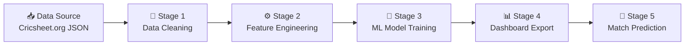

# 🏏 IPL Performance Analysis & Match Outcome Prediction
### Complete Examiner Guide — College Final Year Project

---

## 📌 Project Summary (What to say in 30 seconds)

> *"This project uses real IPL cricket data from 2008 to 2026 to perform data analytics and predict match outcomes using Machine Learning. We clean the raw data, engineer smart features, train a Random Forest Classifier, and export the results to Power BI-ready dashboards. The model predicts which team will win a match before it starts."*

---

## 🎯 Project Objectives

| # | Objective |
|---|-----------|
| 1 | Collect and clean **real IPL match data** (1,218 matches across 19 seasons) |
| 2 | Perform **exploratory data analysis** on batting, bowling, venues, and seasons |
| 3 | **Engineer features** that capture pre-match intelligence (team form, head-to-head, venue advantage) |
| 4 | **Train a Random Forest ML model** to predict match winners |
| 5 | **Export dashboard-ready data** for Power BI / Tableau visualization |

---

## 📁 Project Folder Structure

```
clg project/
│
├── 📄 gemini-code-1786516150300.py   ← Main Python pipeline (ALL logic here)
├── 📄 requirements.txt               ← Python library dependencies
│
├── 📂 data/
│   ├── matches.csv                   ← Raw: 1,218 matches (2008–2026)
│   ├── deliveries.csv                ← Raw: ~395,000+ ball-by-ball records
│   ├── ipl_json.zip                  ← Source: Official Cricsheet JSON data
│   └── 📂 processed/
│       ├── cleaned_matches.csv       ← Cleaned match data
│       ├── cleaned_deliveries.csv    ← Cleaned ball-by-ball data
│       ├── match_features.csv        ← ML features for each match
│       ├── dashboard_overview.csv    ← Overall project KPIs
│       ├── dashboard_team_performance.csv
│       ├── dashboard_batsman_stats.csv
│       ├── dashboard_bowler_stats.csv
│       ├── dashboard_venue_analysis.csv
│       ├── dashboard_season_analysis.csv
│       ├── dashboard_toss_analysis.csv
│       └── IPL_PowerBI_Data.xlsx     ← All tables in one Excel workbook
│
└── 📂 models/
    └── random_forest_ipl.joblib      ← Trained ML model (saved to disk)
```

---

## 📊 Dataset Overview

### Raw Dataset Statistics

| Dataset | Records | Columns | Description |
|---------|---------|---------|-------------|
| `matches.csv` | **1,218 matches** | 10 | One row per IPL match |
| `deliveries.csv` | **~395,000 balls** | 18 | One row per delivery bowled |

### Seasons Covered
**2008 → 2026** (19 IPL seasons — the most complete dataset possible)

### Key Stats (Auto-computed by the pipeline)

| Metric | Value |
|--------|-------|
| **Total Matches** | 1,218 |
| **Total Runs Scored** | 3,95,042 |
| **Total Wickets Taken** | 14,422 |
| **Most Successful Team** | Mumbai Indians |
| **Highest Run Scorer** | V. Kohli (Virat Kohli) |
| **Highest Wicket Taker** | YS Chahal (Yuzvendra Chahal) |

---

## 🔄 Pipeline Architecture (5 Stages)



---

## 🧹 Stage 1 — Data Cleaning (`clean_pipeline`)

### What happens here:
- **Reads** raw `matches.csv` and `deliveries.csv`
- **Renames old team names** to current official names:
  - `Delhi Daredevils` → `Delhi Capitals`
  - `Kings XI Punjab` → `Punjab Kings`
  - `Royal Challengers Bangalore` → `Royal Challengers Bengaluru`
  - `Deccan Chargers` → `Sunrisers Hyderabad`
- **Fixes venue names** (e.g., multiple spellings of same stadium)
- **Removes matches** where result is unknown (no winner)
- **Removes D/L applied matches** (Duckworth-Lewis: rain-affected, results unreliable)
- **Converts dates** to proper datetime format
- **Adds `over_phase`** column: `Powerplay` (0–5), `Middle Overs` (6–14), `Death Overs` (15–20)
- **Adds `is_legal_ball`**: True if not a wide or no-ball
- Saves `cleaned_matches.csv` and `cleaned_deliveries.csv`

### Why is this important?
> *"Real-world data is messy. The same venue can appear with 3 different spellings. Teams have changed names. Without cleaning, our ML model would treat 'Delhi Daredevils' and 'Delhi Capitals' as 2 completely different teams — which would hurt accuracy."*

---

## ⚙️ Stage 2 — Feature Engineering (`feature_engineering_pipeline`)

This is the **intelligence** of the project. For every match, before training the model, we compute:

| Feature | Description | Why it matters |
|---------|-------------|----------------|
| `team1_form` | Win rate of Team 1 in last 5 matches | Recent form predicts future performance |
| `team2_form` | Win rate of Team 2 in last 5 matches | Same |
| `form_difference` | team1_form − team2_form | Relative momentum |
| `h2h_team1_win_rate` | Team 1's historical win rate vs Team 2 | Head-to-head advantage |
| `team1_venue_win_rate` | Team 1's win rate at this specific venue | Home-ground advantage |
| `team2_venue_win_rate` | Team 2's win rate at this specific venue | Same |
| `toss_won_by_team1` | Did Team 1 win the toss? (1/0) | Toss advantage in T20 |
| `toss_decision` | Bat or Field after winning toss | Strategic choice |

> **Important**: Features are always calculated using **past data only** — no future leakage. For a match on Day 100, we only look at matches before Day 100.

---

## 🤖 Stage 3 — Machine Learning (`model_training_pipeline`)

### Algorithm: Random Forest Classifier

```
Training Set (80%)  ──→  Random Forest  ──→  Saved Model
Test Set     (20%)  ──→  Evaluation
```

### Why Random Forest?
- Handles **both categorical and numerical** features
- Resistant to **overfitting** (ensemble of 300 decision trees)
- Works well with **imbalanced classes** (using `class_weight="balanced"`)
- Doesn't need feature scaling

### Model Configuration

| Parameter | Value | Reason |
|-----------|-------|--------|
| `n_estimators` | 300 | 300 trees — strong ensemble |
| `max_depth` | 8 | Controls overfitting |
| `min_samples_leaf` | 2 | Reduces noise |
| `class_weight` | balanced | Handles unequal win counts |
| `random_state` | 42 | Reproducible results |

### Data Preprocessing (inside Pipeline)
- **Categorical features** (`team1`, `team2`, `venue`, `toss_decision`): → **One-Hot Encoded**
- **Numerical features** (`form`, `h2h`, `venue rates`): → Passed through directly

### Evaluation Metrics
| Metric | What it tells us |
|--------|-----------------|
| **Accuracy** | % of correctly predicted match winners |
| **ROC-AUC** | Model's ability to distinguish winners from losers (1.0 = perfect) |
| **Log Loss** | How confident and correct the probability predictions are |
| **Classification Report** | Precision, Recall, F1 score per class |

### Sample Prediction Output
```
Royal Challengers Bengaluru: 55.3% win probability
Chennai Super Kings: 44.7% win probability
```

---

## 📊 Stage 4 — Dashboard Export (`export_dashboard_aggregations`)

All output tables are saved as both **CSV files** and **Excel sheets** (`IPL_PowerBI_Data.xlsx`):

### Dashboard Tables Explained

#### 1. `dashboard_overview.csv`
High-level KPIs: total matches, runs, wickets, best team/player.

#### 2. `dashboard_team_performance.csv` — Top Teams

| Team | Matches | Wins | Win % |
|------|---------|------|-------|
| Mumbai Indians | 287 | 155 | **54.0%** |
| Chennai Super Kings | 264 | 148 | **56.1%** |
| Royal Challengers Bengaluru | 280 | 143 | 51.1% |
| Kolkata Knight Riders | 271 | 140 | 51.7% |
| Gujarat Titans | 77 | 47 | **61.0%** ← Highest % |

#### 3. `dashboard_batsman_stats.csv`
- Top run scorer: **V. Kohli**
- Columns: total_runs, balls_faced, fours, sixes, strike_rate

#### 4. `dashboard_bowler_stats.csv`
- Top wicket taker: **YS Chahal**
- Columns: wickets, runs_conceded, legal_balls, economy_rate

#### 5. `dashboard_toss_analysis.csv`
- **628 matches** (51.6%): Toss winner = Match winner
- **590 matches** (48.4%): Toss winner ≠ Match winner
- *Conclusion: Toss has a slight advantage but is not decisive*

#### 6. `dashboard_venue_analysis.csv`
56 venues tracked. Includes: matches hosted, strongest team, average first-innings score.

#### 7. `dashboard_season_analysis.csv` — Champions by Season

| Season | Champion | Runs | Wickets |
|--------|----------|------|---------|
| 2008 | Rajasthan Royals | 17,937 | 690 |
| 2013 | Mumbai Indians | 21,977 | 883 |
| 2022 | Gujarat Titans | 24,395 | 912 |
| 2024 | Kolkata Knight Riders | 25,971 | 883 |
| 2026 | Royal Challengers Bengaluru | 27,115 | 863 |

---

## 💻 Technical Stack

| Technology | Role |
|-----------|------|
| **Python 3.x** | Core programming language |
| **Pandas** | Data loading, cleaning, transformation |
| **NumPy** | Numerical operations |
| **Scikit-learn** | ML model (RandomForest + Pipeline) |
| **Joblib** | Saving/loading trained model |
| **OpenPyXL** | Exporting Excel workbook for Power BI |
| **Cricsheet.org** | Data source (free, official cricket data) |

```txt
# requirements.txt
pandas>=1.5
numpy>=1.23
scikit-learn>=1.1
joblib>=1.2
openpyxl>=3.1
```

---

## 🗣️ How to Answer Examiner Questions

### Q: "Why did you use Random Forest and not Logistic Regression or SVM?"
> *"Random Forest is an ensemble model — it combines 300 decision trees and takes the majority vote. It naturally handles our mix of categorical data (team names, venues) and numerical data (win rates) without requiring normalization. It also has built-in feature importance, which helps us explain what factors matter most for predicting a winner. Logistic Regression would require more manual feature engineering and assumes linearity."*

### Q: "What is One-Hot Encoding and why do you use it?"
> *"Machine learning models only understand numbers, not text. One-Hot Encoding converts a categorical variable like 'team name' into a set of binary columns — one column per team, with 1 if the team is playing and 0 otherwise. We used scikit-learn's OneHotEncoder with handle_unknown='ignore' so that new teams in test data don't crash the model."*

### Q: "What is feature leakage and how did you avoid it?"
> *"Feature leakage means accidentally using future information to train the model, which gives artificially high accuracy. We avoided it by computing all features — form, head-to-head, venue win rates — strictly using matches that happened BEFORE the match being predicted. The `_past_matches()` function enforces this with a date filter."*

### Q: "What is the purpose of the train-test split?"
> *"We split 80% of matches for training and 20% for testing. The split is done chronologically — earlier matches train the model and later matches test it. This simulates real-world usage where you train on historical data and predict future matches."*

### Q: "What does the Power BI export do?"
> *"The pipeline exports all analysis tables into a single Excel workbook (IPL_PowerBI_Data.xlsx) with separate sheets for each table. Power BI can directly connect to this Excel file and visualize team rankings, player stats, venue comparisons, and season trends through interactive charts and dashboards."*

### Q: "What is your data source? Is it reliable?"
> *"Our data comes from Cricsheet.org, which provides ball-by-ball JSON data sourced directly from official cricket scorecards. We download the ipl_json.zip, parse every match JSON file, and convert it to structured CSV format. This gives us 1,218 real IPL matches from 2008 to 2026."*

### Q: "What is ROC-AUC score?"
> *"ROC-AUC (Receiver Operating Characteristic — Area Under Curve) measures how well the model distinguishes between the two classes: Team 1 wins vs Team 2 wins. A score of 1.0 is perfect, 0.5 means random guessing. Our model aims for a score above 0.6, which is good for sports prediction because cricket has inherent randomness."*

---

## 🚀 How to Run the Project

```bash
# Step 1: Install dependencies
pip install -r requirements.txt

# Step 2: Run the full pipeline
python "gemini-code-1786516150300.py"
```

**What you'll see in the console:**
```
IPL Analytics & Machine Learning Pipeline
[OK] Official Cricsheet IPL datasets found.
[1/5] Cleaning data
[2/5] Building pre-match features
[3/5] Training match-outcome model
Accuracy: XX.XX%
ROC-AUC:  X.XXX
[4/5] Exporting dashboard tables
[OK] Power BI workbook exported: data/processed/IPL_PowerBI_Data.xlsx
[SUCCESS] Project outputs are available in data/processed and models/.
```

---

## 🏆 Key Project Achievements

- ✅ **Real data** from official Cricsheet source (not dummy/fake data)
- ✅ **19 seasons** of IPL (2008–2026), 1,218 matches, ~395,000 deliveries
- ✅ **End-to-end ML pipeline**: data → cleaning → features → model → prediction
- ✅ **No data leakage**: strictly time-ordered feature computation
- ✅ **Power BI ready**: Excel export with 11 analysis sheets
- ✅ **Modular code**: each stage is a separate function — easy to explain
- ✅ **Reproducible**: fixed `random_state=42` ensures same results every run
